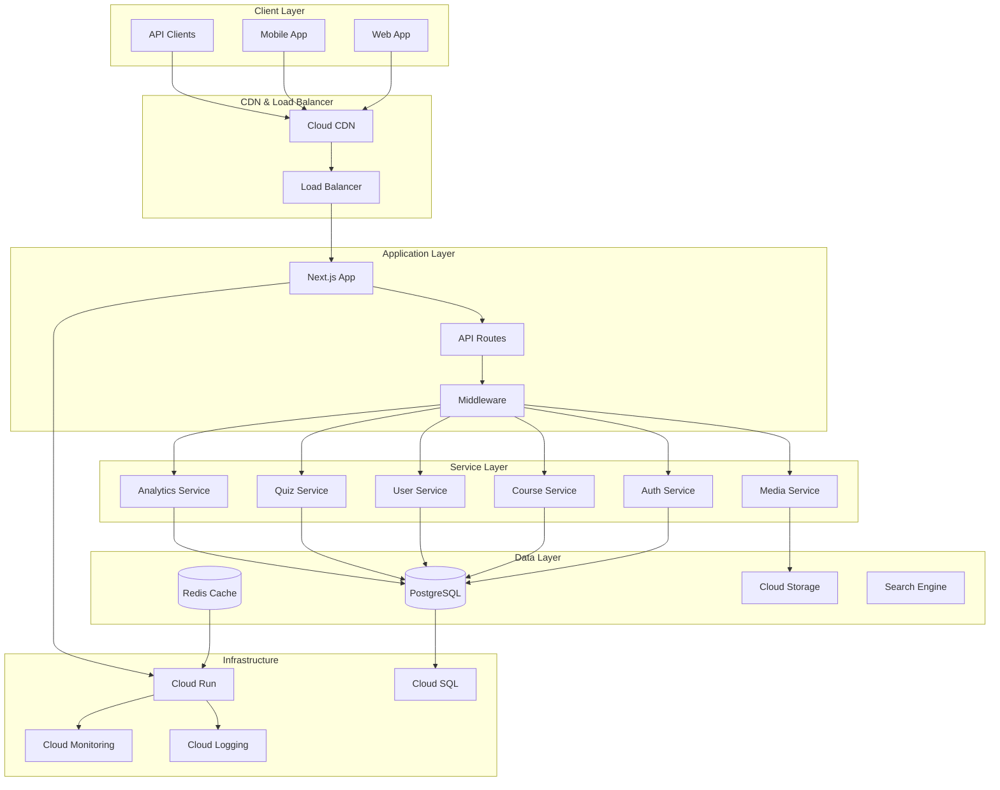
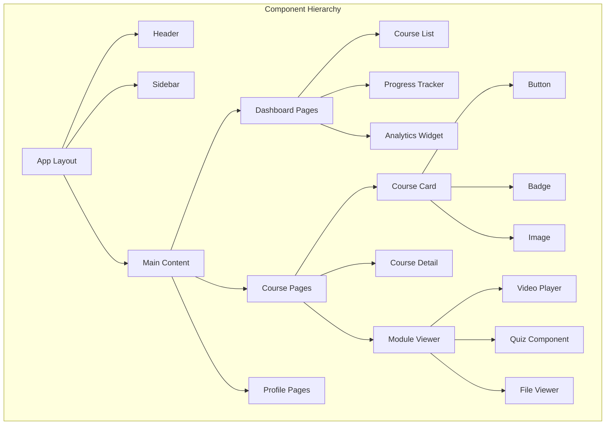
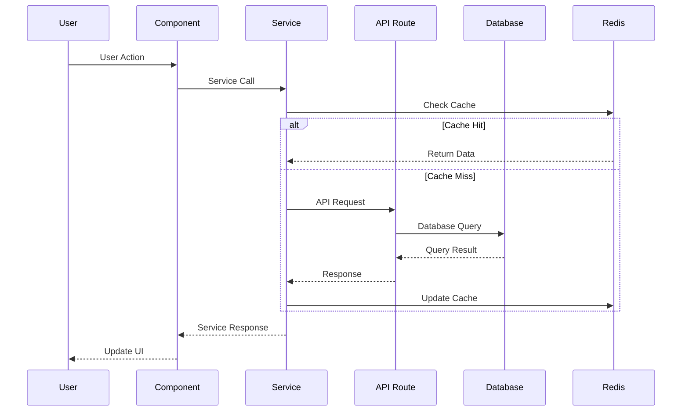
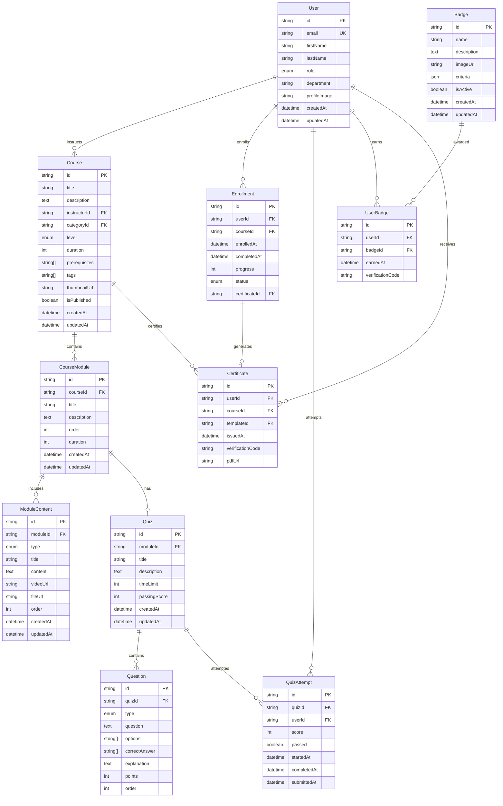
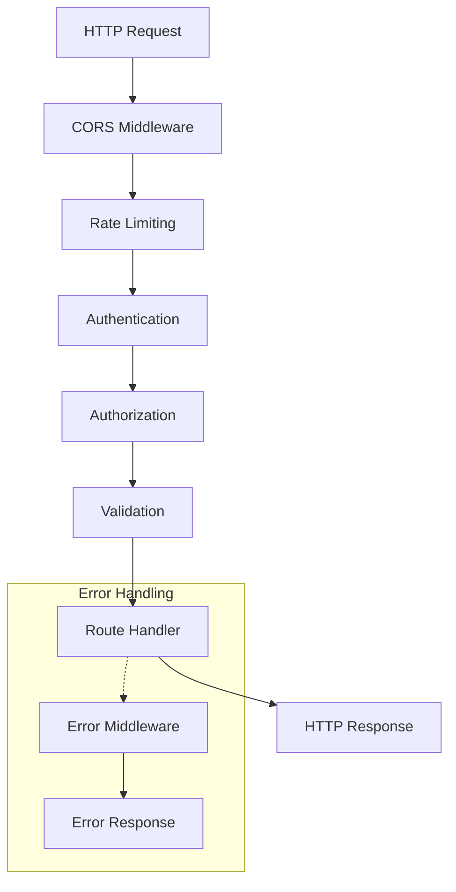
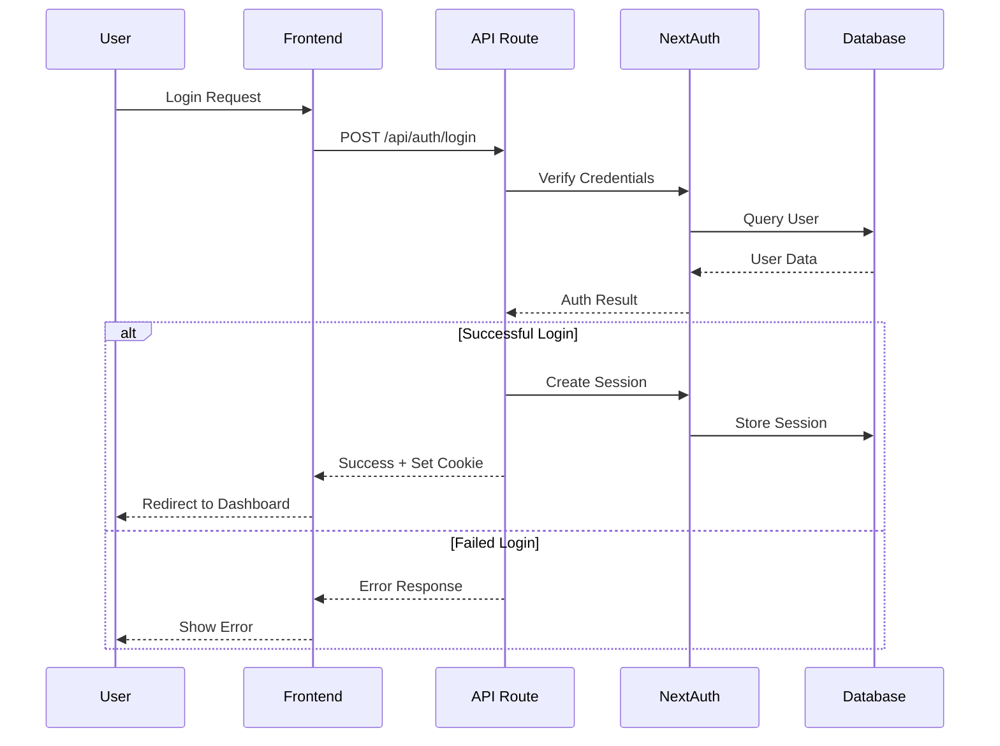
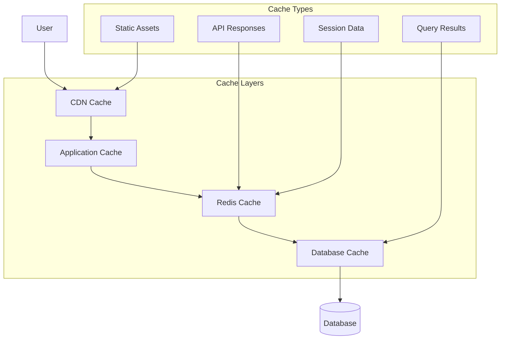
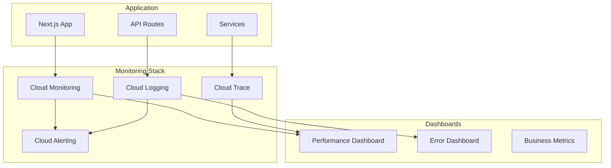
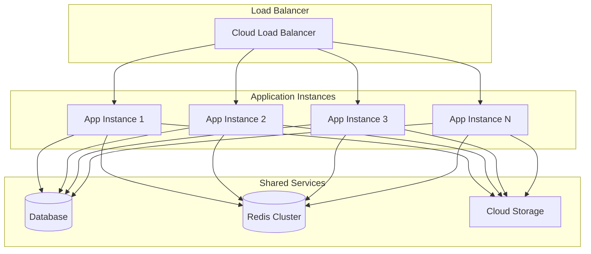
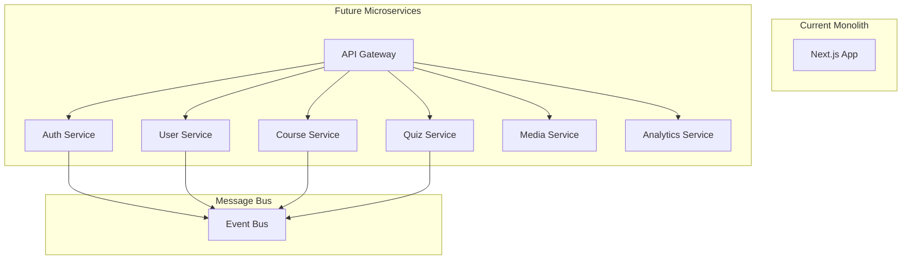

# Learning Platform Architecture Documentation

## Overview

The Learning Platform is built as a modern, scalable web application using Next.js 14 with App Router, TypeScript, and a microservices-friendly architecture deployed on Google Cloud Platform.

## Architecture Principles

### Core Principles

1. **Scalability** - Designed to handle growing user base and content volume
2. **Modularity** - Loosely coupled components and services
3. **Performance** - Optimized for speed and responsiveness
4. **Security** - Built-in security best practices
5. **Maintainability** - Clean code and clear separation of concerns
6. **Observability** - Comprehensive monitoring and logging

### Design Patterns

- **Repository Pattern** - Data access abstraction
- **Service Layer Pattern** - Business logic encapsulation  
- **Factory Pattern** - Object creation management
- **Observer Pattern** - Event-driven architecture
- **Singleton Pattern** - Shared resource management

## System Architecture



## Technology Stack

### Frontend
- **Next.js 14** - React framework with App Router
- **TypeScript** - Type-safe JavaScript
- **Tailwind CSS** - Utility-first CSS framework
- **React Query** - Data fetching and caching
- **React Hook Form** - Form management
- **Radix UI** - Accessible component primitives
- **Recharts** - Data visualization

### Backend
- **Node.js 18+** - JavaScript runtime
- **Next.js API Routes** - API endpoints
- **Prisma** - Database ORM
- **NextAuth.js** - Authentication
- **Zod** - Schema validation
- **Redis** - Caching and sessions

### Database
- **PostgreSQL 14** - Primary database
- **Redis** - Caching and session storage
- **Prisma Schema** - Database modeling

### Infrastructure
- **Google Cloud Run** - Container hosting
- **Cloud SQL** - Managed PostgreSQL
- **Cloud Storage** - File storage
- **Cloud CDN** - Content delivery
- **Cloud Monitoring** - Observability
- **Docker** - Containerization

## Application Architecture

### Folder Structure

```
learning-platform/
├── src/
│   ├── app/                    # Next.js App Router
│   │   ├── (auth)/            # Authentication routes
│   │   ├── (dashboard)/       # Protected dashboard
│   │   ├── api/               # API routes
│   │   └── globals.css        # Global styles
│   ├── components/            # React components
│   │   ├── ui/               # Base UI components
│   │   ├── admin/            # Admin components
│   │   ├── learner/          # Learner components
│   │   └── instructor/       # Instructor components
│   ├── lib/                  # Utility libraries
│   │   ├── auth.ts           # Authentication config
│   │   ├── db.ts            # Database connection
│   │   └── utils.ts         # Helper functions
│   ├── services/            # Business logic services
│   │   ├── auth.service.ts  # Authentication service
│   │   ├── course.service.ts # Course management
│   │   └── user.service.ts  # User management
│   ├── types/               # TypeScript definitions
│   ├── middleware.ts        # Next.js middleware
│   └── utils/              # Utility functions
├── prisma/                 # Database schema and migrations
├── tests/                  # Test files
├── config/                 # Configuration files
├── docs/                   # Documentation
└── public/                 # Static assets
```

### Component Architecture



### Data Flow Architecture



## Service Layer Architecture

### Authentication Service

```typescript
interface AuthService {
  // User authentication
  login(credentials: LoginCredentials): Promise<AuthResult>;
  register(userData: RegisterData): Promise<User>;
  logout(): Promise<void>;
  
  // Session management
  getSession(): Promise<Session | null>;
  refreshToken(token: string): Promise<string>;
  
  // Password management
  forgotPassword(email: string): Promise<void>;
  resetPassword(token: string, password: string): Promise<void>;
  
  // Email verification
  verifyEmail(token: string): Promise<void>;
  resendVerification(email: string): Promise<void>;
}
```

### Course Service

```typescript
interface CourseService {
  // Course management
  getCourses(filters: CourseFilters): Promise<PaginatedResponse<Course>>;
  getCourse(id: string): Promise<Course>;
  createCourse(data: CreateCourseData): Promise<Course>;
  updateCourse(id: string, data: UpdateCourseData): Promise<Course>;
  deleteCourse(id: string): Promise<void>;
  
  // Enrollment management
  enrollUser(userId: string, courseId: string): Promise<Enrollment>;
  getEnrollments(userId: string): Promise<Enrollment[]>;
  updateProgress(enrollmentId: string, progress: number): Promise<void>;
  
  // Content management
  getModules(courseId: string): Promise<CourseModule[]>;
  getModuleContent(moduleId: string): Promise<ModuleContent[]>;
  
  // Analytics
  getCourseAnalytics(courseId: string): Promise<CourseAnalytics>;
}
```

### User Service

```typescript
interface UserService {
  // Profile management
  getProfile(userId: string): Promise<User>;
  updateProfile(userId: string, data: UpdateProfileData): Promise<User>;
  uploadAvatar(userId: string, file: File): Promise<string>;
  
  // User management (admin)
  getUsers(filters: UserFilters): Promise<PaginatedResponse<User>>;
  createUser(data: CreateUserData): Promise<User>;
  updateUser(id: string, data: UpdateUserData): Promise<User>;
  deactivateUser(id: string): Promise<void>;
  
  // Analytics
  getUserStats(userId: string): Promise<UserStats>;
  getUserActivity(userId: string): Promise<UserActivity[]>;
}
```

## Database Architecture

### Entity Relationship Diagram



### Database Indexes

```sql
-- Performance-critical indexes
CREATE INDEX idx_users_email ON users(email);
CREATE INDEX idx_courses_published ON courses(is_published);
CREATE INDEX idx_enrollments_user_id ON enrollments(user_id);
CREATE INDEX idx_enrollments_course_id ON enrollments(course_id);
CREATE INDEX idx_enrollments_status ON enrollments(status);
CREATE INDEX idx_course_modules_course_id ON course_modules(course_id);
CREATE INDEX idx_module_content_module_id ON module_content(module_id);
CREATE INDEX idx_quiz_attempts_user_id ON quiz_attempts(user_id);
CREATE INDEX idx_quiz_attempts_quiz_id ON quiz_attempts(quiz_id);

-- Composite indexes for common queries
CREATE INDEX idx_courses_category_level ON courses(category_id, level);
CREATE INDEX idx_enrollments_user_status ON enrollments(user_id, status);
CREATE INDEX idx_quiz_attempts_user_quiz ON quiz_attempts(user_id, quiz_id);
```

## API Architecture

### RESTful API Design

```typescript
// API Route Structure
/api/
├── auth/                    # Authentication endpoints
│   ├── login/              # POST /api/auth/login
│   ├── register/           # POST /api/auth/register
│   ├── logout/             # POST /api/auth/logout
│   ├── forgot-password/    # POST /api/auth/forgot-password
│   ├── reset-password/     # POST /api/auth/reset-password
│   └── verify-email/       # POST /api/auth/verify-email
├── users/                  # User management
│   ├── profile/            # GET/PUT /api/users/profile
│   └── stats/              # GET /api/users/stats
├── admin/                  # Admin endpoints
│   └── users/              # GET/POST /api/admin/users
├── courses/                # Course management
│   ├── route.ts            # GET/POST /api/courses
│   └── [id]/               # Course-specific routes
│       ├── route.ts        # GET/PUT/DELETE /api/courses/[id]
│       └── enroll/         # POST /api/courses/[id]/enroll
├── quiz/                   # Quiz endpoints
│   └── [quizId]/           # GET/POST /api/quiz/[quizId]
├── certificates/           # Certificate management
│   ├── generate/           # POST /api/certificates/generate
│   └── verify/[code]/      # GET /api/certificates/verify/[code]
├── upload/                 # File upload
├── health/                 # Health checks
│   ├── route.ts            # GET /api/health
│   └── redis/              # GET /api/health/redis
├── cache/                  # Cache management
└── sessions/               # Session management
```

### API Response Standards

```typescript
// Success Response
interface SuccessResponse<T> {
  success: true;
  data: T;
  message?: string;
  pagination?: PaginationInfo;
}

// Error Response
interface ErrorResponse {
  success: false;
  error: string;
  message: string;
  details?: Record<string, any>;
  timestamp: string;
}

// Pagination Info
interface PaginationInfo {
  total: number;
  page: number;
  limit: number;
  totalPages: number;
  hasNext: boolean;
  hasPrev: boolean;
}
```

### Middleware Architecture



## Security Architecture

### Authentication Flow



### Authorization Matrix

| Role | Users | Courses | Admin | Analytics | System |
|------|-------|---------|-------|-----------|--------|
| **Admin** | CRUD | CRUD | CRUD | Read | CRUD |
| **Instructor** | Read | CRUD* | - | Read* | - |
| **Manager** | Read* | Read | - | Read* | - |
| **Learner** | Read* | Read | - | Read* | - |

*Restricted to own resources or team members

### Security Headers

```typescript
// Next.js Security Headers
const securityHeaders = [
  {
    key: 'X-DNS-Prefetch-Control',
    value: 'on'
  },
  {
    key: 'Strict-Transport-Security',
    value: 'max-age=63072000; includeSubDomains; preload'
  },
  {
    key: 'X-XSS-Protection',
    value: '1; mode=block'
  },
  {
    key: 'X-Frame-Options',
    value: 'DENY'
  },
  {
    key: 'X-Content-Type-Options',
    value: 'nosniff'
  },
  {
    key: 'Referrer-Policy',
    value: 'origin-when-cross-origin'
  }
];
```

## Performance Architecture

### Caching Strategy



### Cache Implementation

```typescript
// Redis Cache Service
class CacheService {
  private redis: Redis;
  
  async get<T>(key: string): Promise<T | null> {
    const cached = await this.redis.get(key);
    return cached ? JSON.parse(cached) : null;
  }
  
  async set(key: string, value: any, ttl: number = 3600): Promise<void> {
    await this.redis.setex(key, ttl, JSON.stringify(value));
  }
  
  async invalidate(pattern: string): Promise<void> {
    const keys = await this.redis.keys(pattern);
    if (keys.length > 0) {
      await this.redis.del(...keys);
    }
  }
}

// Cache Keys Strategy
const CACHE_KEYS = {
  USER_PROFILE: (userId: string) => `user:profile:${userId}`,
  COURSE_LIST: (filters: string) => `courses:list:${filters}`,
  COURSE_DETAIL: (courseId: string) => `course:detail:${courseId}`,
  USER_ENROLLMENTS: (userId: string) => `user:enrollments:${userId}`
};
```

### Performance Optimizations

1. **Database Level**
   - Connection pooling
   - Query optimization
   - Database indexes
   - Read replicas for scaling

2. **Application Level**
   - Response caching
   - Image optimization
   - Code splitting
   - Bundle optimization

3. **Infrastructure Level**
   - CDN for static assets
   - Load balancing
   - Auto-scaling
   - Geographic distribution

## Monitoring and Observability

### Monitoring Architecture



### Key Metrics

```typescript
// Application Metrics
interface AppMetrics {
  // Performance Metrics
  responseTime: number;
  throughput: number;
  errorRate: number;
  availability: number;
  
  // Business Metrics
  activeUsers: number;
  courseCompletions: number;
  quizAttempts: number;
  certificatesIssued: number;
  
  // Infrastructure Metrics
  cpuUsage: number;
  memoryUsage: number;
  diskUsage: number;
  networkLatency: number;
  
  // Database Metrics
  connectionPool: number;
  queryTime: number;
  slowQueries: number;
  cacheHitRate: number;
}
```

### Health Check Implementation

```typescript
// Health Check Service
export async function checkSystemHealth(): Promise<HealthStatus> {
  const checks = await Promise.allSettled([
    checkDatabase(),
    checkRedis(),
    checkExternalServices(),
    checkFileStorage()
  ]);
  
  const status = checks.every(check => 
    check.status === 'fulfilled' && check.value.healthy
  ) ? 'healthy' : 'unhealthy';
  
  return {
    status,
    timestamp: new Date().toISOString(),
    checks: checks.map((check, index) => ({
      name: ['database', 'redis', 'external', 'storage'][index],
      status: check.status === 'fulfilled' ? 
        (check.value.healthy ? 'up' : 'down') : 'error',
      responseTime: check.status === 'fulfilled' ? 
        check.value.responseTime : null,
      error: check.status === 'rejected' ? 
        check.reason.message : null
    }))
  };
}
```

## Scalability Considerations

### Horizontal Scaling



### Scaling Strategies

1. **Application Scaling**
   - Stateless application design
   - Container orchestration
   - Auto-scaling policies
   - Load balancing

2. **Database Scaling**
   - Read replicas
   - Connection pooling
   - Query optimization
   - Sharding strategies

3. **Cache Scaling**
   - Redis clustering
   - Cache partitioning
   - Distributed caching
   - Cache invalidation strategies

### Performance Benchmarks

| Metric | Target | Acceptable | Critical |
|--------|--------|------------|----------|
| **Response Time** | < 200ms | < 500ms | > 1000ms |
| **Throughput** | 1000 req/s | 500 req/s | < 100 req/s |
| **Error Rate** | < 0.1% | < 1% | > 5% |
| **Availability** | 99.9% | 99.5% | < 99% |
| **Database Query** | < 50ms | < 100ms | > 500ms |
| **Cache Hit Rate** | > 90% | > 80% | < 70% |

## Deployment Architecture

### Container Strategy

```dockerfile
# Multi-stage production build
FROM node:18-alpine AS base
FROM base AS deps
FROM base AS builder
FROM base AS runner

# Production optimizations
RUN addgroup --system --gid 1001 nodejs
RUN adduser --system --uid 1001 nextjs
COPY --from=builder --chown=nextjs:nodejs /app/.next/standalone ./
COPY --from=builder --chown=nextjs:nodejs /app/.next/static ./.next/static
```

### Infrastructure as Code

```yaml
# Cloud Run Service Configuration
apiVersion: serving.knative.dev/v1
kind: Service
metadata:
  name: learning-platform
  annotations:
    run.googleapis.com/ingress: all
spec:
  template:
    metadata:
      annotations:
        autoscaling.knative.dev/minScale: "1"
        autoscaling.knative.dev/maxScale: "100"
        run.googleapis.com/memory: "2Gi"
        run.googleapis.com/cpu: "2"
    spec:
      containerConcurrency: 1000
      timeoutSeconds: 300
      containers:
      - image: gcr.io/project/learning-platform:latest
        ports:
        - containerPort: 3000
        env:
        - name: NODE_ENV
          value: production
        resources:
          limits:
            memory: 2Gi
            cpu: 2000m
```

## Future Architecture Considerations

### Microservices Migration



### Event-Driven Architecture

```typescript
// Event System Design
interface DomainEvent {
  id: string;
  type: string;
  aggregateId: string;
  version: number;
  data: Record<string, any>;
  timestamp: Date;
  userId?: string;
}

// Event Types
const EVENTS = {
  USER_REGISTERED: 'user.registered',
  COURSE_ENROLLED: 'course.enrolled',
  QUIZ_COMPLETED: 'quiz.completed',
  BADGE_EARNED: 'badge.earned',
  CERTIFICATE_ISSUED: 'certificate.issued'
} as const;
```

### Performance Optimization Roadmap

1. **Phase 1: Current Optimizations**
   - Database indexing
   - Redis caching
   - Image optimization
   - Code splitting

2. **Phase 2: Advanced Optimizations**
   - GraphQL implementation
   - Server-side rendering optimization
   - Progressive web app features
   - Edge computing

3. **Phase 3: Architecture Evolution**
   - Microservices migration
   - Event-driven architecture
   - CQRS implementation
   - Machine learning integration

This architecture documentation provides a comprehensive overview of the Learning Platform's technical design, serving as a reference for development, deployment, and scaling decisions.